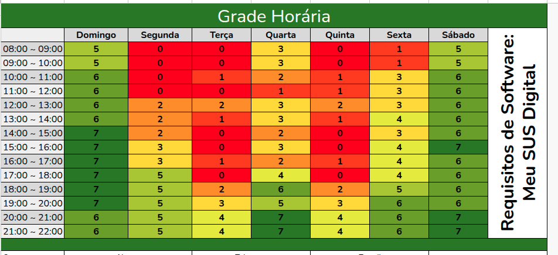

# Heatmap

## Introdução

Para definir os horários das reunioes semanais, foi utilizado um *heatmap* que mostra a disponibilidade de cada membro do grupo. O objetivo é encontrar os melhores horários para as reuniões, levando em consideração a disponibilidade de todos os membros. As cores do *heatmap* indicam a disponibilidade de cada membro em cada horário, onde o verde representa disponibilidade alta, o amarelo representa disponibilidade média e o vermelho representa baixa disponibilidade.

---

## Heatmap

Figura 1: *Heatmap* versão 1.

 
Fonte: Autores.

---

## Histórico de Versão

| Versão | Data          | Descrição                          | Autor(es)     |  Revisor(es)  |
| ------ | ------------- | ---------------------------------- | ------------- | ------------- |
| `1.0`  |  16/04/2025 |  Criação da página e adição do heatmap | [Gabriel Castelo](https://github.com/GabrielCastelo-31)  | [Artur de Camargos](https://github.com/ArturDCR) |
