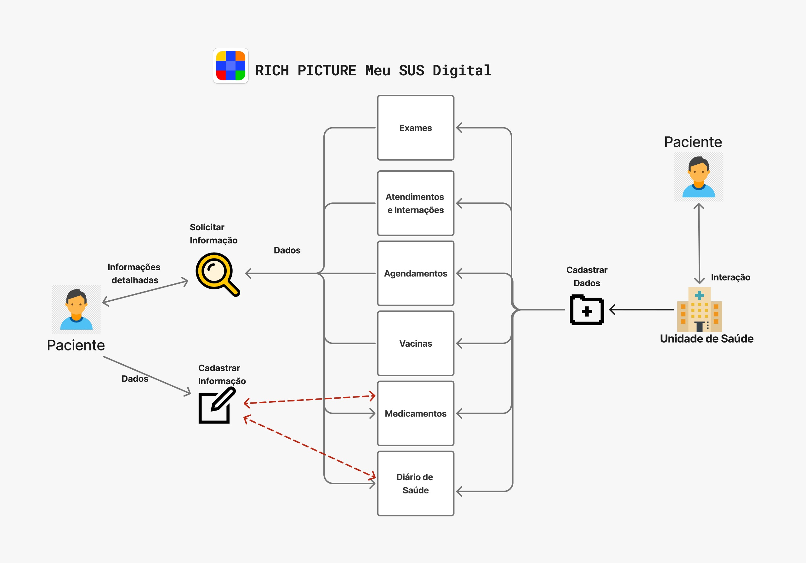

# Rich Picture

## Introdução
O *Rich Picture* é uma ferramenta visual usada para compreender e representar contextos de trabalho complexos, especialmente no início do design de sistemas. Por meio de desenhos informais e simbólicos, ele retrata os envolvidos no processo (*stakeholders*), suas preocupações, estruturas organizacionais e os fluxos de trabalho, permitindo uma visão ampla e integrada do ambiente. Seu objetivo é facilitar o entendimento de diferentes pontos de vista, promovendo decisões de projeto mais alinhadas com a realidade e as necessidades dos usuários.

---

Figura 1: *Rich Picture* versão 1.

Fonte: Autores.

Figura 2: Legenda do *Rich Picture* versão 1.

Fonte: Autores.

---

## Referências Bibliográficas

> - [1] MONK, Andrew; HOWARD, Steve. The Rich Picture: A Tool for Reasoning About Work Context. Methods and tools, 1998.

## Histórico de Versão

| Versão | Data          | Descrição                          | Autor(es)     |  Revisor(es)  |
| ------ | ------------- | ---------------------------------- | ------------- | ------------- |
| `1.0`  |  13/04/2025 |  Criação do Documento | [Pedro](https://github.com/pedroeverton217)  | [Gabriel](https://github.com/GabrielCastelo-31) e [Davi](https://github.com/Davicamilo23) |
