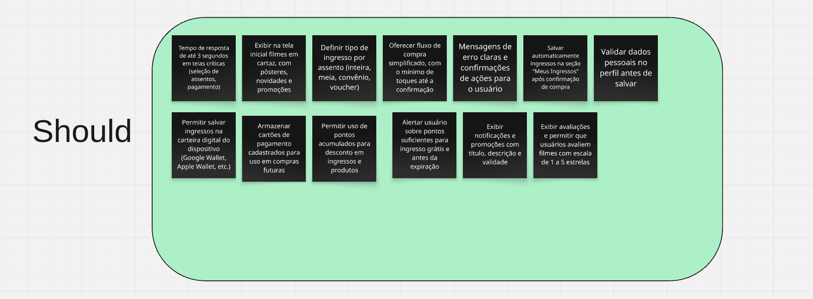

# MoSCoW

## Introdução
Este documento apresenta a priorização de requisitos para um sistema de venda de ingressos e gestão de cinemas, utilizando a técnica **MoSCoW**. Essa metodologia categoriza os requisitos em quatro grupos: **Must Have** (obrigatórios), **Should Have** (importantes), **Could Have** (desejáveis) e **Won't Have** (não prioritários). O objetivo é garantir o foco nas funcionalidades críticas para o sucesso do produto, alinhando-se às necessidades do usuário e às restrições técnicas.

## Metodologia
A priorização seguiu os critérios:
- **Must Have**: Requisitos essenciais para o funcionamento básico do sistema.
- **Should Have**: Funcionalidades importantes, mas que podem ser adiadas sem comprometer o lançamento.
- **Could Have**: Recursos desejáveis, porém não urgentes.
- **Won't Have**: Itens excluídos do escopo atual devido a baixo impacto ou complexidade.

---

## Tabela de Requisitos

| Categoria     | Requisito                                                                                                                                                     |
|---------------|---------------------------------------------------------------------------------------------------------------------------------------------------------------|
| **Must Have** | - Interface acessível para pessoas com deficiência visual (leitores de tela) e baixo-visão - Interface intuitiva, com navegação fácil e boa usabilidade - Exibir resumo da compra e permitir aplicação de cupom de desconto - Autenticar usuário por e-mail e senha - Garantir uptime de 99,5% para funções críticas - Criar e editar perfil do usuário, gerenciar dados pessoais e métodos de pagamento - Recuperação de conta: enviar link de redefinição de senha por e-mail, recuperar e-mail via CPF e redefinir com código - Permitir compra de ingressos com cartão de crédito, débito ou Pix - Permitir alteração de preferências de idioma - Contraste de interface conforme WCAG A/AA - Exibir sessões com data, horário, idioma, formato e sala - Navegar por abas: Home, Filmes, Cinemas, Snack Bar, Club e Mais - Buscar filmes por nome - Disponibilizar ingresso digital no app, eliminando a necessidade de impressão - Exibir mapa da sala com indicação gráfica de assentos ocupados, livres e especiais, e permitir seleção pelos usuários  - Detectar localização automaticamente e permitir alteração manual - Validar e-mail e senha antes de criação ou redefinição de conta - Ocultar parcialmente o e-mail recuperado para segurança (exibir com asteriscos) - Exibir mapa de assentos com indicação gráfica clara de ocupação e disponibilidade - Proteger dados de pagamento e histórico do usuário com criptografia - Exibir informações do filme (título, sinopse, gênero, duração, direção, elenco, distribuidor, origem) - Manter informações da sessão (filme, data, hora e sala) visíveis em todas as etapas do fluxo de compra - Exigir seleção de ao menos um assento antes de prosseguir - Permitir compra de múltiplos ingressos em uma única transação - Gerar QR Code e chave Pix para pagamentos via Pix - Garantir legenda clara para cores e ícones no mapa de assentos - Atualizar automaticamente o valor total conforme seleção de ingressos e produtos |
| **Should Have** | - Tempo de resposta de até 3 segundos em telas críticas (seleção de assentos, pagamento) - Exibir na tela inicial filmes em cartaz, com pôsteres, novidades e promoções - Definir tipo de ingresso por assento (inteira, meia, convênio, voucher) - Oferecer fluxo de compra simplificado, com o mínimo de toques até a confirmação - Mensagens de erro claras e confirmações de ações para o usuário - Salvar automaticamente ingressos na seção “Meus Ingressos” após confirmação de compra - Validar dados pessoais no perfil antes de salvar - Permitir salvar ingressos na carteira digital do dispositivo (Google Wallet, Apple Wallet, etc.) - Alertar usuário sobre pontos suficientes para ingresso grátis e antes da expiração - Exibir avaliações e permitir que usuários avaliem filmes com escala de 1 a 5 estrelas - Exibir notificações e promoções com título, descrição e validade - Armazenar cartões de pagamento cadastrados para uso em compras futuras - Permitir uso de pontos acumulados para desconto em ingressos e produtos |
| **Could Have** | - Impedir avanço para pagamento com carrinho vazio - Sistema responsivo e adaptável a diferentes tamanhos de tela (smartphone e tablet) - Listar filmes em cartaz, pré-venda e futuros lançamentos - Remover automaticamente promoções expiradas da interface - Autenticação por biometria ou PIN para operações sensíveis - Permitir criação de conta (nome, e-mail, senha, CPF) e login com Google/redes sociais - Exibir histórico de filmes assistidos (data, horário, cinema) e histórico de compras na bomboniere - Exibir trailers dentro do app - Sugerir cinemas com base no histórico de visitas e na localização atual - Filtrar filmes por categoria e exibir avaliações de público e plataformas externas - Permitir notificações personalizadas (ex.: “avise-me quando o filme X entrar em cartaz”) - Permitir que o usuário salve cinemas como favoritos - Notificações push customizáveis pelo usuário - Disponibilizar área dedicada ao Cinemark Club: ingressos, pontos acumulados e validade - Integrar bomboniere ao app para compra antecipada de itens e retirada rápida - Exibir recomendações de filmes baseadas em histórico e preferências |
| **Won't Have** | - Limitar quantidade máxima de 20 unidades por item no Snack Bar |

---

  

  
  

---

## Gravação com Usuário
- [Link para a gravação](https://unbbr-my.sharepoint.com/personal/221008051_aluno_unb_br/_layouts/15/stream.aspx?id=%2Fpersonal%2F221008051%5Faluno%5Funb%5Fbr%2FDocuments%2FGrava%C3%A7%C3%B5es%2FPrioriza%C3%A7%C3%A3o%20100%24%2D20250504%5F211328%2DGrava%C3%A7%C3%A3o%20de%20Reuni%C3%A3o%2Emp4&referrer=StreamWebApp%2EWeb&referrerScenario=AddressBarCopied%2Eview%2Ef7a7d1a9%2De66b%2D4dc1%2D8dd3%2Dda0b0cffd821)  

---

## Histórico de Versão

| Versão | Data       | Descrição                          | Autor(es)     | Revisor(es) |
|--------|------------|------------------------------------|---------------|-------------|
| `1.0`  | 04/05/2025 | Criação do Documento | [Davi](https://github.com/Davicamilo23) | Todos |
| `1.1`  | 04/05/2025 | Incluindo dados da reunião | [Artur](https://github.com/ArturDCR) | [Davi](https://github.com/Davicamilo23) |